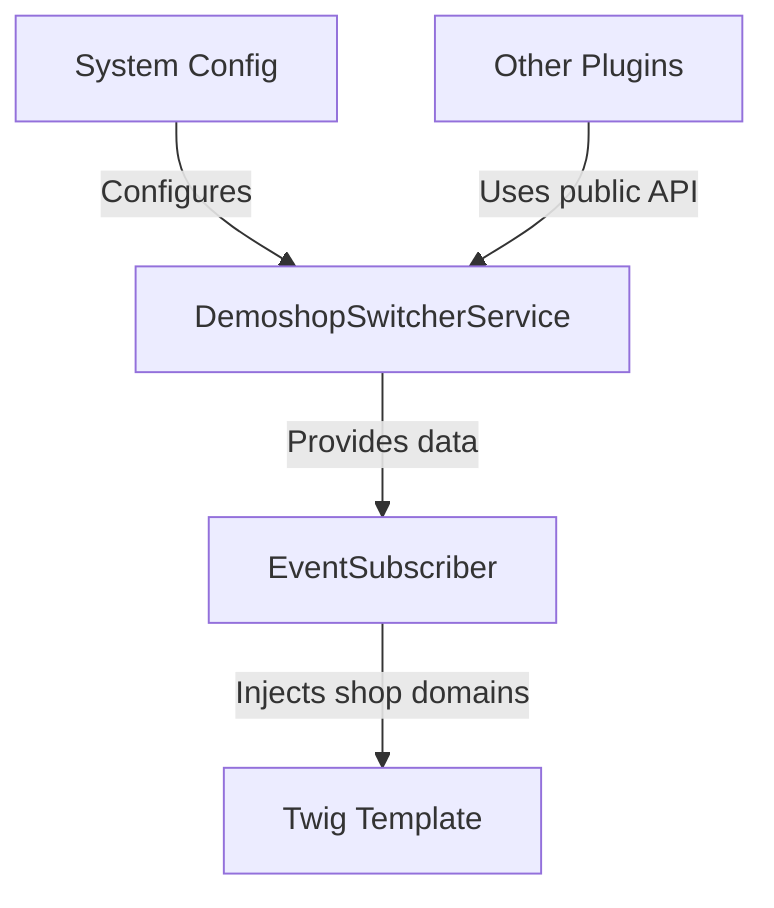

# Project Summary: Topdata Demoshop Switcher SW6

## 1. Overview
- **Type**: Shopware 6 plugin
- **Purpose**: Provides domain switching between demo environments while preserving URL structure
- **Versions**: Supports Shopware 6.4-6.7
- **License**: MIT

## 2. Architecture

## 3. Key Components
- **`DemoshopSwitcherService`**:
  - Handles domain configuration parsing
  - Generates switch URLs preserving paths/parameters
  - Provides public `getShopDomains()` API
- **`MyEventSubscriber`**:
  - Listens to `GenericPageLoadedEvent`
  - Injects shop domains into storefront page
- **`top-bar.html.twig`**:
  - Renders domain switcher UI in header
- **Configuration**:
  - Textarea for domain list (domain|label format)
  - Accessed via Shopware admin panel

## 4. Technical Standards
- **PHP**: Strict typing, dependency injection
- **Shopware**: Event-driven architecture
- **Frontend**: Twig template extension
- **Compatibility**: PHP 8.2+, Shopware 6.4-6.7

## 5. Usage
1. Configure domains in Shopware admin
2. Switcher appears in storefront header
3. Other plugins can access via `DemoshopSwitcherService::getShopDomains()`