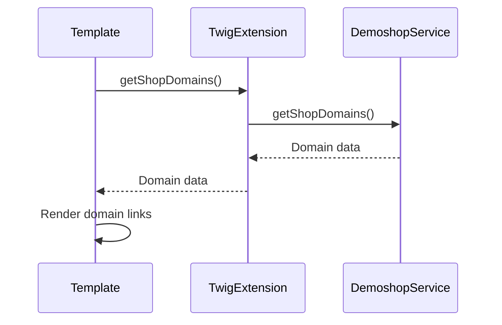

# Migration Plan: Replace Event Subscriber with Twig Extension

## Objective
Migrate from event listener-based implementation to Twig extension for Shopware 6.7 compatibility, as the `page` object is no longer available.

## Current Implementation Analysis
- Event subscriber (`MyEventSubscriber`) adds shop domains to `page` object
- Template accesses data via `page.getExtension()`
- Service (`DemoshopSwitcherService`) provides domain data logic
- Shopware 6.7 removes `page` object, breaking current implementation

## Proposed Solution
Replace event subscriber with Twig extension that provides shop domains directly to templates.

### Steps

1. **Create Twig Extension Class**  
   Path: `src/Twig/DemoshopSwitcherTwigExtension.php`  
   ```php
   <?php
   namespace Topdata\TopdataDemoshopSwitcherSW6\Twig;
   
   use Topdata\TopdataDemoshopSwitcherSW6\Service\DemoshopSwitcherService;
   use Twig\Extension\AbstractExtension;
   use Twig\TwigFunction;
   
   class DemoshopSwitcherTwigExtension extends AbstractExtension
   {
       private $demoshopSwitcherService;
   
       public function __construct(DemoshopSwitcherService $demoshopSwitcherService)
       {
           $this->demoshopSwitcherService = $demoshopSwitcherService;
       }
   
       public function getFunctions()
       {
           return [
               new TwigFunction('getShopDomains', [$this, 'getShopDomains']),
           ];
       }
   
       public function getShopDomains(): array
       {
           return $this->demoshopSwitcherService->getShopDomains();
       }
   }
   ```

2. **Update Service Configuration**  
   Modify `src/Resources/config/services.xml`:  
   ```xml
   <service id="Topdata\TopdataDemoshopSwitcherSW6\Twig\DemoshopSwitcherTwigExtension">
       <argument type="service" id="Topdata\TopdataDemoshopSwitcherSW6\Service\DemoshopSwitcherService"/>
       <tag name="twig.extension"/>
   </service>
   ```

3. **Update Template**  
   Modify `src/Resources/views/storefront/layout/header/top-bar.html.twig`:  
   ```twig
   
   
       <a href="{{ d.href }}"
          class="btn btn-sm btn-primary active"
          title="{{ d.name }}">
           {{ d.label }}
       </a>
   
   ```

4. **Remove Obsolete Code**  
   - Delete `src/Subscriber/MyEventSubscriber.php`
   - Remove event subscriber service from `services.xml`

### Data Flow Diagram


### Verification Plan
1. Clear Shopware cache (`bin/console cache:clear`)
2. Visit storefront to confirm switcher appears
3. Test domain switching functionality
4. Verify no errors in logs (`var/log/production.log`)
5. Confirm all links generate correct URLs
6. Test with multiple domain configurations

### Rollback Plan
1. Revert all file changes
2. Restore `MyEventSubscriber.php`
3. Revert `services.xml` to original state